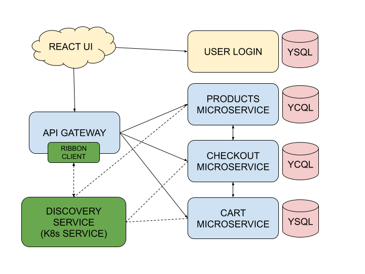

# YugaStore in Java

This is an implementation of a sample ecommerce app. This microservices-based retail marketplace or eCommerce app is composed of **microservices written in Spring (Java)**, a **UI based on React** and **YugaByte DB as the distributed SQL database**. 

If you're using this demo app, please :star: this repository! We appreciate your support.

## Trying it out

This repo contains all the instructions you need to [run the app on your laptop](#building-the-app).

You can also [try the app out](https://yugastore-ui.cfapps.io/) online, it is hosted on [Pivotal Web Services](https://run.pivotal.io/).

# Features

* Written fully in Spring
* Desgined for multi-region and Kubernetes-native deployments
* Features 6 microservices
* Uses a discovery service that the microservices register with
* Sample data has over 6K products in the store

## Architecture

The architecture diagram of YugaStore is shown below.




| Microservice         | YugaByte DB API | Description           |
| -------------------- | --------------- | --------------------- |
| [react-ui](https://github.com/YugaByte/yugastore-java/tree/master/react-ui) | - | A react-based UI for the eCommerce online marketplace app.
| [api-gateway](https://github.com/YugaByte/yugastore-java/tree/master/api-gateway-microservice) | - | This microservice handles all the external API requests. The UI only communicates with this microservice.
| [products](https://github.com/YugaByte/yugastore-java/tree/master/products-microservice) | YCQL | This microservice contains the entire product catalog. It can list products by categories, return the most popular products as measured by sales rank, etc.
| [cart](https://github.com/YugaByte/yugastore-java/tree/master/cart-microservice) | YCQL | This microservice deals with users adding items to the shopping cart. It has to be necessarily highly available, low latency and often multi-region.
| [checkout](https://github.com/YugaByte/yugastore-java/tree/master/checkout-microservice) | YSQL | This deals with the checkout process and the placed order. It also manages the inventory of all the products because it needs to ensure the product the user is about to order is still in stock.
| [login](https://github.com/YugaByte/yugastore-java/tree/master/login-microservice) | YSQL | Handles login and authentication of the users. *Note that this is still a work in progress.*

# Build and run

## Build Jars with Maven 
To build, simply run the following from the base directory:

```
$ mvn -DskipTests package
```


## Build a Docker Image with Maven

To get started quickly, you can run Jib without even changing your pom.xml:

```
$ ./mvnw com.google.cloud.tools:jib-maven-plugin:dockerBuild -Dimage=nchandrappa/cart-microservice
```

To push to a Docker registry you use the build goal, instead of dockerBuild, i.e.

```
$ ./mvnw com.google.cloud.tools:jib-maven-plugin:build -Dimage=nchandrappa/cart-microservice
```

Note: Update docker image id to reflect the docker repository of your choice.

To run the app on your local Minikube, you need to first install YugaByte DB, create the necessary tables, start each of the microservices and finally the React UI.

## Running the app on Minikube

Make sure you have built the docker images as described above and you're in the `yugastore-java` base directory. Now do the following steps.


## verify if minikube in running

```
$ minikube status
```

## Step 1: Install and initialize YugaByte DB

You can [install YugaByte DB by following these instructions](https://docs.yugabyte.com/latest/quick-start/).

a. Install YugabyteDB in minikube

```
$ kubectl create -f k8s-deployments/util/default-rbac.yml
$ kubectl create namespace yb-demo
$ kubectl create -f k8s-deployments/Yugabyte/yugabyte-statefulset-rf-1.yaml -n yb-demo

```

b. Verify YugabyteDB installation by connecting to postgres terminal using the following command

```
$ kubectl -n yb-demo exec -it yb-tserver-0 /home/yugabyte/bin/ysqlsh -- -h yb-tserver-0  --echo-queries
```

c. find the YCQL and YSQL ip-address:port for YugabyteDB cluster by running the below command 

```
$ minikube service yb-db-service -n yb-demo
```

set the following environment variables from above data.  example: 

```
$ export CQLSH_HOST=192.168.64.3
$ export CQLSH_PORT=31620
$ export YSQLSH_HOST=192.168.64.3
$ export YSQLSH_PORT=32517
```

d. Now create the necessary tables as shown below. Load sample dataset by following the steps here: (resources/README.md)

```
$ cd resources
$ cqlsh -f schema.cql
```

Next, load some sample data. Follow the data load steps in 

```
$ cd resources
$ ./dataload.sh
```

Create the postgres tables in `resources/schema.sql` for the YSQL tables

```
$ ysqlsh -h $YSQLSH_HOST -p $YSQLSH_PORT -d postgres -f schema.sql
```

## Step 2: Deploy yugastore-java microservices

```
$ kubectl create -f k8s-deployments/microservices/yugastore-deployment.yaml
```


## Step 3: browse to the marketplace app

```
$ minikube service yugastore-ui
```

this command will open up Yugastore Dashboard.


# Next Steps

- [Deploy Yugastore on Istio enabled Kubernetes Cluster] (/resources/k8s-deployoment-instructions.md)


# Learn more

- [Learn YugabyteDB](https://learn.yugabyte.com/)
- [Contribute to YugabyteDB](https://www.yugabyte.com/community/)
- [Contribute to Spring Data YugabyteDB](https://github.com/yugabyte/spring-data-yugabytedb)
